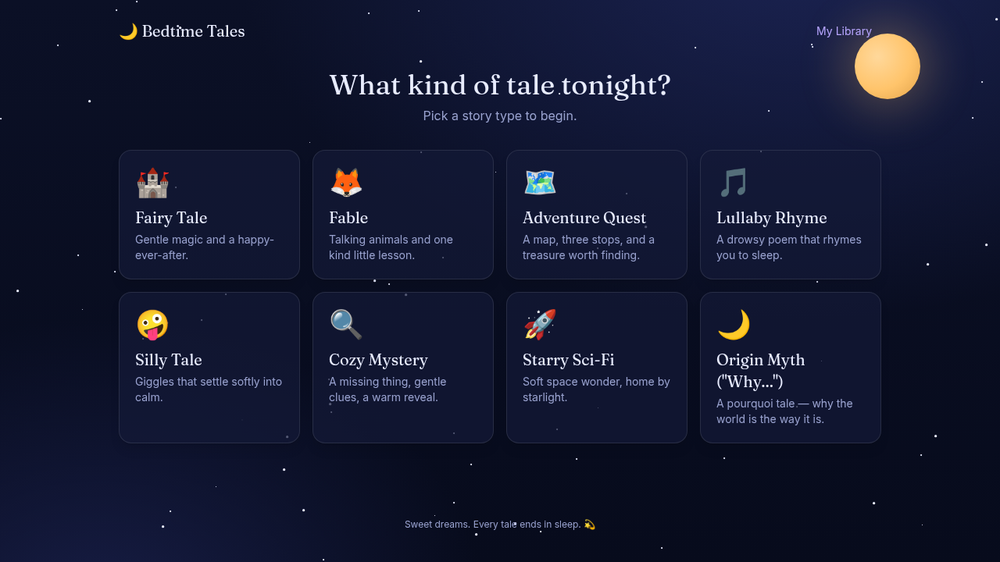
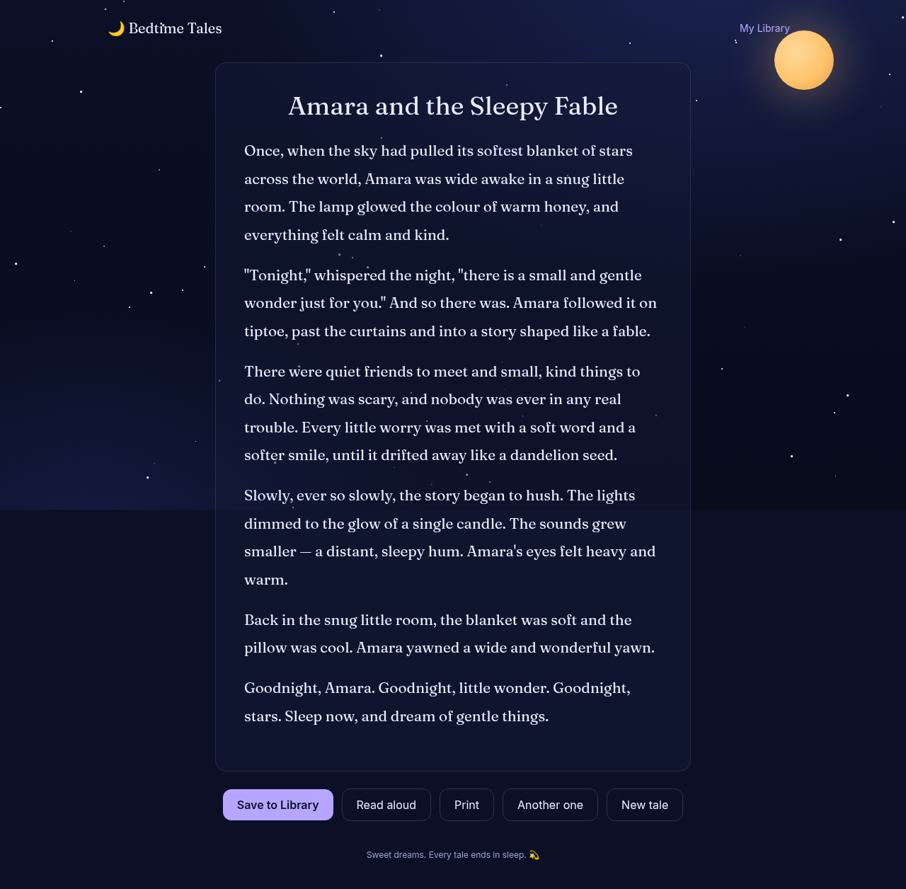

# 🌙 Bedtime Tale Generator

Pick a real folktale **tale type** — a pattern from the Aarne–Thompson–Uther
(ATU) index — name a hero, and get a custom bedtime story that is _engineered to
end in sleep_. Whatever happens earlier — magic, mischief, a quest, a giggle —
every tale decelerates into a soft "goodnight" cadence, so the last line lands
like a held breath before sleep.

Built with **Next.js (App Router) + TypeScript + Tailwind**, streaming stories
live from the **Claude API** (`claude-opus-4-8`).





## Features

- **Real ATU tale types** — every story is shaped after a genuine tale type from
  the [Aarne–Thompson–Uther folktale index](https://en.wikipedia.org/wiki/Aarne%E2%80%93Thompson%E2%80%93Uther_Index),
  gently softened for bedtime.
  - **87 featured types** with a hand-authored narrative shape, signature motifs,
    and voice — Cinderella (ATU 510A), The Dragon-Slayer (300), The Gingerbread
    Man (2025) and the rest of the original twelve, plus the types promoted out
    of the generated tier as beats were written for them.
  - **A browsable catalogue** (`/browse`) of the full bedtime-safe set — search by
    name or ATU number, filter by category, and turn any type into a story. Darker
    or adult tale types are excluded entirely.
- **Fables & wisdom tales** — a second story family: 11 curated traditional
  fables from seven named traditions (Aesopic, Jātaka, Panchatantra,
  Hitopadesha, Kalīla wa Dimna, Akan, and Chinese, Japanese and Korean
  tradition), each grown from a 200-word kernel into a 600–1,600-word bedtime
  story, with parent-facing provenance and per-fable child-adaptation metadata.
- **The wind-down arc** — a global rule in the storyteller's prompt guarantees
  every story softens toward sleep.
- **Age-aware** — 3–5, 6–8, and 9–12 bands tune vocabulary and gentleness.
- **Live streaming** — the story appears token-by-token as it's written.
- **Read aloud** — a slow, soothing text-to-speech voice (Web Speech API).
- **Local Library** — save favourites to your browser (nothing leaves the
  device); re-read, print, or delete them later.
- **Print-friendly** — a clean stylesheet for a bedside printout.
- **Offline mock mode** — run and test the whole app with no API key.

## Quick start

```bash
npm install
cp .env.example .env.local   # then add your ANTHROPIC_API_KEY
npm run dev                  # http://localhost:3000
```

Get an API key from the [Anthropic Console](https://console.anthropic.com/).

### No key? Run in mock mode

The app runs fully offline with a canned storyteller — perfect for a demo or
for development:

```bash
MOCK_TALE=1 npm run dev
```

Without a key **and** without mock mode, the app still works but shows a gentle
"the storyteller is getting ready" message instead of a story.

## Scripts

| Script              | What it does                                  |
| ------------------- | --------------------------------------------- |
| `npm run dev`       | Start the dev server                          |
| `npm run build`     | Production build                              |
| `npm run start`     | Serve the production build                     |
| `npm run lint`      | ESLint                                        |
| `npm run typecheck` | `tsc --noEmit`                                |
| `npm test`          | Unit tests (Vitest)                           |
| `npm run test:e2e`  | End-to-end tests (Playwright, runs mock mode) |

## How it works

```
app/
  page.tsx            pick → form → streaming story (client state machine)
  browse/page.tsx     searchable ATU catalogue → hands off to the generator
  library/page.tsx    saved tales (localStorage)
  api/tale/route.ts   validate → Claude stream → newline-delimited JSON
components/           TaleTypePicker, StoryForm, StoryView, Starfield, LibraryCard
lib/
  atu-index.ts        the bedtime-safe ATU catalogue (all browsable tale types)
  tale-types.ts       the featured registry (the 12 originals + both promoted tiers)
  fables.ts           the curated fable corpus (the second story family)
  prompt.ts           system persona (wind-down + safety) + brief assembly
  fable-prompt.ts     the kernel / adaptation / expansion blocks for a fable
  schema.ts           zod validation for the request (tagged by story family)
  stream-client.ts    browser-side NDJSON consumer
  library.ts          localStorage read/write
  speech.ts           read-aloud helpers
  mock.ts             offline stand-in storyteller
```

The API route validates the request, builds a system prompt (persona, the
wind-down arc, age-appropriate safety rules, and the output contract) plus a
per-request brief, then streams the story from Claude as newline-delimited JSON
events (`{"t":"delta","text":"…"}` … `{"t":"done"}`). User-supplied details are
sanitized and clearly framed as story _data_, never instructions.

### Two story families

The first screen has two doors, and they are genuinely different data models —
not one catalogue with a flag on it.

|  | **Folktales** | **Fables & wisdom tales** |
|---|---|---|
| Identified by | an ATU tale-type number | a named traditional story, in a named tradition |
| Lives in | `lib/atu-index.ts`, `lib/tale-types.ts` | `lib/fables.ts` |
| Size | 208 types, three tiers, 87 hand-authored | 11 fables, all hand-modelled |
| Drives the prompt with | beats, signature elements, tone, opener | `coreBeats` + adaptation metadata + `expansionBeats` |
| Extras | Thompson motifs (up to 3 per story) | provenance, themes, per-fable child adaptation |
| Safety comes from | the stem screens in `lib/safety.ts`, plus review | per-fable metadata written by a person who read the tale |
| Length | 300 / 600 / 900 words | 600–800 / 900–1,200 / 1,300–1,600 words |
| Request | `{ kind: "atu", taleTypeId }` | `{ kind: "fable", fableId }` |

Both share everything that makes this a bedtime app: the same `SYSTEM_PROMPT`,
the same wind-down arc, the same age bands, the same sanitizing and injection
guard, the same streaming route, library, read-aloud and print.

**Why fables are not ATU tale types.** The ATU index is an index of *patterns*:
a number and a canonical title, with no answer to "whose telling, in which
collection, under what licence" — because for a pattern there is no single
answer. A fable is the opposite: "The Lion and the Mouse" is Perry 150 of the
Aesopic corpus, "The Quails and the Net" is Jātaka 33, and the tradition and the
collection are the interesting facts. Forcing fables into ATU would assign
numbers the index does not assign and flatten Panchatantra, Jātaka and Aesopic
transmission into one European scheme. So they get their own small registry.

**Requests stay backward compatible.** `taleRequestSchema` is a discriminated
union on `kind`, but any request arriving without a `kind` is stamped `"atu"`
first. Every request the app has ever sent, and every shared `/?type=<id>` deep
link, still validates unchanged. Fables opt in explicitly, and get `/?fable=<id>`.

### Fables: kernel, adaptation, expansion

Three ideas do all the work, and they are what a new curated fable has to supply.

**`coreBeats` — the kernel.** The causal spine that makes the traditional fable
recognisable: sequence, problem, reversal, inference, consequence. Drop one and
it stops being that fable. The brief tells the storyteller to play them through
*once*, cleanly, in the middle of the story. What is inherited is the mechanism,
never the prose.

**`expansionBeats` — where it may grow.** A traditional fable is 150–300 words
and a bedtime story is 900–1,500, and the naive way to close that gap — running
the encounter three times, or padding the conflict — destroys the fable, because
a reversal that happens repeatedly is not a reversal. So the brief allocates the
extra length outward, to setting, travel, ordinary routines, relationships,
discovery, aftermath, reflection and the sleepy return, and says explicitly where
length may *not* come from. `expansionBeats` name the places this particular tale
grows well. Mouse meets lion, mouse helps lion — with a world built around it,
not four more meetings.

The default shape is ordinary world → a reason to travel → approach → the kernel
→ the result settling → understanding it → the journey home → narrowing senses →
somewhere safe → sleep. It is offered as a shape, not a checklist; ten literal
beats produces ten mechanical paragraphs. The last third still obeys the global
wind-down arc, and the moral is asked to arrive through events and reflection
rather than a closing `MORAL:` line.

**`adaptation` — the child-safety metadata.** Traditional fables contain a great
deal that has no business at bedtime, and "make it child-friendly" hands that
judgement to the model afresh on every request. Instead the corpus carries it, in
a file that can be reviewed in a pull request. Each fable names its `concerns`
from a fixed list — death, injury, predation, threat, abandonment, betrayal,
humiliation, punishment, coercion, frightening transformation, hunger peril —
and then says what to do, with four verbs that are not synonyms:

- **`preserve`** — the reason the fable works;
- **`soften`** — keep it, lower its temperature;
- **`substitute`** — swap it for something carrying the same weight;
- **`remove`** — leave it out; nothing replaces it.

`preserve` exists to stop the other three from sterilising the tale. If
cleverness beats brute force because a weak character escapes being eaten, the
adaptation may remove the eating — but not the asymmetry, the real problem, the
inference, or the escape. **"Safe" must not come to mean "nothing happens"**, and
the brief says so in as many words. `ageFloor` marks tales kept for older
listeners; picking a younger band does not refuse the request, it asks for every
softening applied in full, because a parent who knows their child outranks a
number in a data file.

### Adding a curated fable

Append one object to `FABLES` in `lib/fables.ts`. Nothing else changes — the
picker, the schema, the brief and the provenance panel are all driven from it.

1. `id` (kebab-case, must not collide with an ATU id), `title` (our own English
   title, not any translator's wording), `emoji`, `tradition` (add it to
   `FABLE_TRADITIONS` if it is new — name a people, a language community or a
   textual tradition, never a continent), `region`, and a one-sentence `setup`
   for the card.
2. `coreBeats` — 4–7 beats, in your own words, describing structure. Never paste
   a telling.
3. `themes`, and `expansionBeats` naming where this tale has room to breathe.
4. `adaptation` — `concerns`, then `preserve` (always), and whichever of
   `soften` / `substitute` / `remove` the concerns require. A fable with concerns
   and no handling fails `tests/unit/fables.test.ts`.
5. `source` — see below.

**Provenance expectations.** Record the collection, the compiler or collector as
an attribution rather than an assertion of authorship, the year of the *cited
edition*, and any scholarly designation (`Perry 150`, `Jātaka 33`). Then set
`confidence`, and if it is not `high`, write a `note` saying exactly what is
uncertain — the note is shown to parents. Prefer primary and public-domain
editions, university, library and museum references, Gutenberg or Internet
Archive scans of appropriate historical editions, and standard folklore
reference works; do not treat generic "world folktale" sites as authoritative.
A URL is optional and should be omitted rather than guessed. **Never invent
cultural provenance**, and never round a disputed attribution up to a certain
one.

**What must never be stored here.** No copyrighted modern retelling, in whole or
in part. No public-domain translation's prose either — this repo stores
structured factual metadata and our own summaries of traditional structure, and
the app generates original prose over them. The "Behind the story" panel says
plainly that the tale is inspired by a tradition and is *not* an authentic
traditional telling; nothing in the product should imply otherwise.

### The three catalogue tiers

The catalogue is 208 tale types in three tiers, ordered by how much anybody has
actually vouched for them:

| Tier | Count | Where | Drives the prompt with |
|---|---|---|---|
| `featured` | 87 | `lib/tale-types.ts` + `lib/tale-types-curated.ts` + `lib/tale-types-extended-authored.ts`, hand-authored | beats, signature elements, tone, opener |
| `curated` | 0 | `EXTRA_TYPES` in `lib/atu-index.ts`, hand-authored | title + blurb |
| `extended` | 121 | `lib/atu-extended.ts`, generated **then read** | title + blurb |

`curated` is empty because all fifty of its entries were promoted once beats
were written for them. The tier stays because it is where the next hand-written
blurb-only type lands.

`extended` is shrinking the same way. `lib/tale-types-extended-authored.ts`
takes generated-tier entries and gives them beats, and `lib/atu-index.ts`
filters any promoted id out of the generated tier so the catalogue never lists
one twice. The generated file itself still lists every type the pipeline
screened, which is correct: it records what the knowledge base produced, and
promotion is a fact about this repo rather than about that pipeline.

A promoted entry keeps its ATU number — that is its identity — but gets a
child-facing `label` in place of the canonical scholarly title, a re-chosen
emoji (the generated tier assigns those from a per-division rotation, so a wolf
story can arrive carrying a turtle), and a `tagline` written for the
storyteller. Its original blurb stays on the browse card, and the canonical
title stays in `lib/atu-canonical.ts` with its source and licence.

Only `buildUserBrief()` in `lib/prompt.ts` (server-only) reads a `featured`
type's beats, signature elements, tone, or opener. Everything else — the
picker, the browse grid, `lib/atu-index.ts` — needs just the label, emoji,
tagline, ATU number, and category, so those six fields live separately in the
generated `lib/tale-types-catalogue.ts` (`npm run tale-catalogue:build`).
Client components import that instead of the full registry, so the ~55KB of
prompt-only prose never rides along into the browser bundle.

**Adding a hand-authored type:** append one object to `EXTRA_TYPES` — `id`,
`atu`, `title`, `emoji`, and a gentle `blurb`; the category is derived from the
ATU number. To make it featured, also add a `TaleType` record with the same `id`
carrying `beats`, `signatureElements`, `tone` and `exampleOpener`. Keep it
bedtime-safe: no death, peril, horror, cruelty, or romance.

The home picker deliberately shows only the original twelve. Sixty-two cards is
a wall to scroll past on a phone at bedtime, and the rest are one tap away.

**On the beats for the fifty:** they are written as the *gentle* telling, not
the faithful one. Rapunzel's prince traditionally falls into thorns and is
blinded; the Fisherman's Wife ends in a storm and a hovel; the Fox and the Crow
ends with the crow humiliated. `SYSTEM_PROMPT` forbids all of that, so writing
the beats faithfully would only set the brief arguing with the safety rules —
and the brief would lose, less predictably. They were written from knowledge of
these very well-known tales rather than from the public-domain texts, which
means nothing is quoted but also that they are checked against the shape of a
tale rather than against an edition.

**Regenerating the extended tier** (needs the knowledge base export):

```bash
npm run catalogue:propose   # ATU index → data/atu-candidates.json
npm run catalogue:build     # candidates + motif screens → lib/atu-extended.ts
npm run motifs:build        # → lib/motifs.ts and lib/credits.ts
```

### How the generated tier stays bedtime-safe

The full ATU index is ~2,250 tale types and most of them have no business in a
bedtime app. Four automated screens run in order, each failing closed:

1. **The stem screen** (`lib/safety.ts`) over the canonical title. It matches
   *stems*, not words, because an earlier word-matching version passed ATU 36 —
   "The Fox **Rapes** the She-Bear" — on the grounds that its list held `rape`
   and `raped` but not `rapes`.
2. **Two whole divisions are excluded outright.** *Anecdotes and Jokes*
   (1200–1999) are funny because somebody is humiliated, and *Tales of the
   Stupid Ogre* (1000–1199) turn on harming an ogre. Both are structurally at
   odds with "humour is warm and never mean". A word list will always be one
   unfamiliar word behind; a structural rule will not.
3. **Motif screens.** A tale type with no motif data is dropped — "we could not
   check" is not a pass. So is any type carrying a motif with a knowledge-base
   content advisory, or whose *motif labels* trip the stem screen. Labels are
   far more descriptive than titles, so this catches the most.
4. **A regression list** in `tests/unit/atu-index.test.ts` names every cut ATU
   number and fails if a regeneration lets one back in.

And then — decisively — **somebody read them.** The screens produced 254 types;
reading all 254 found that about a quarter should not have been there: flaying,
mutilation, crucifixion, twenty-odd marriage plots, and a dozen index buckets
like "Unfinished Tales" that are not stories at all. None of those was a bug in
the screens; they are the vocabulary and judgement gaps a word list will always
have.

So `data/atu-blurbs.reviewed.json` carries a verdict for every tale type, with
the reason for each of the 109 cuts, and `tests/unit/atu-extended.test.ts` fails
if anything ships without a `"safe"` record. The tier is reviewed data, not
screen output. Changing a screen changes which candidates reach the review file,
so the test is also what catches a newly-admitted type nobody has looked at.

None of that is the real backstop. `SYSTEM_PROMPT` in `lib/prompt.ts` forbids
death, injury, peril, cruelty, horror and romance in **every** story regardless
of tale type, and the wind-down arc applies unconditionally. The screens decide
what a parent is *offered*; the prompt decides what a child *hears*.

Generated entries carry no blurb. A model could write one for each, but an
invented description printed next to a real ATU number reads as authoritative
when nobody has read the tale — so the catalogue shows the number and division
and says nothing it cannot stand behind.

### Traditional twists (motifs)

`lib/motifs.ts` carries 340 Thompson Motif-Index motifs across 137 tale types —
the real ones folklorists recorded, filtered to those short and gentle enough to
hand a bedtime storyteller. The form offers up to three per story. The knowledge
base records these links as *inferred* rather than asserted, so the prompt asks
for them as ingredients and never as a plot. Attribution is required by their
licences and is shown at `/credits`.

### Tale-type data & sources

Tale-type numbers and titles follow the ATU index, cross-checked against
CC0 [Wikidata property P2540](https://www.wikidata.org/wiki/Property:P2540) and
the open [`trilogy`](https://github.com/j-hagedorn/trilogy) dataset. Full
public-domain tale texts (for reference) live at
[Ashliman's Folktexts](https://sites.pitt.edu/~dash/folktexts.html) and the
[Multilingual Folk Tale Database](http://www.mftd.org/). The one-line blurbs in
this repo are original, bedtime-framed descriptions — not the academic ATU
summaries.

## On your phone

The app is an installable PWA. Open it on a phone, use "Add to Home Screen", and
it launches standalone with its own icon and no browser chrome.

- **Offline reading.** A service worker (`public/sw.js`) caches the app shell,
  and saved tales already live in `localStorage`, so the library is readable
  with no signal. `/api/tale` is deliberately never intercepted — a service
  worker in front of an NDJSON stream would buffer a story that is supposed to
  arrive word by word.
- **Reading controls.** A−/A+ text sizing and a "deep night" mode that dims the
  whole palette a further notch, both remembered per device and applied on every
  page.
- **Screen wake lock** while a story streams or is read aloud, so the phone does
  not lock two paragraphs from "goodnight".
- **Safe-area insets** so nothing hides under a notch or a home indicator.

Pinch-to-zoom is deliberately left enabled. Locking it is a common way to make a
web app feel native and it takes zoom away from anyone who needs it, which for a
page of prose read in the dark is exactly the wrong trade.

## Privacy

Stories and any details you enter (like a child's name) are sent to the Claude
API to generate the tale, and saved tales live only in your browser's
`localStorage`. Nothing is stored on a server by this app.

## Deployment

Deploy anywhere that runs a Node.js Next.js server (e.g. Vercel). Set
`ANTHROPIC_API_KEY` in the environment. The `/api/tale` route streams, so it
must run on the Node.js runtime (it already declares this).

### Set a passcode before you put it on the internet

`/api/tale` spends your Anthropic key on every request and there is still no
rate limiting, so an open deployment is an open tab at your expense. Set
`PARENT_PASSCODE` and the app asks for it once:

```bash
PARENT_PASSCODE="something only you know"
```

One shared code, no accounts. Entering it sets an httpOnly cookie that lasts 30
days, so a phone is unlocked once and then forgets about it; changing the value
signs every device out, because the token signing key is derived from the
passcode itself. Comparison is timing-safe and the passcode never reaches the
client bundle.

Leave it unset and the app is open, which is what you want locally — that is
also what keeps the Playwright suite running with no setup.

> **Still missing:** per-IP rate limiting. The passcode stops strangers, not a
> shared code that leaks.

## The ATU knowledge base

`kb/` holds a separate deliverable: a provenance-first folklore knowledge base
of ATU tale types and Thompson Motif-Index motifs, built to the architecture in
[`docs/atu-kb-assessment.md`](docs/atu-kb-assessment.md). It is a Python +
Postgres subproject with no runtime connection to this app — see
[`kb/README.md`](kb/README.md) to run it, and
[`docs/atu-kb-decisions.md`](docs/atu-kb-decisions.md) for the decisions taken
and the rights questions that remain open.

The app consumes it only at build time. `npm run sync:atu` regenerates the
factual fields of `lib/atu-index.ts` — ATU number and canonical title — from the
knowledge base's license-filtered export, and never touches the hand-authored
`blurb`, `emoji` or `id`. Those are original bedtime content, deliberately not
the academic summaries, and the knowledge base does not model them. Without an
export present the script is a no-op, so `npm run build` never depends on
Postgres.
